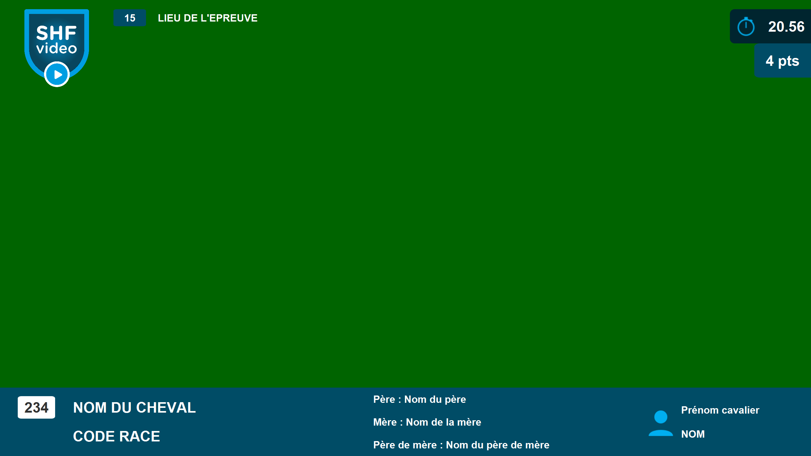

# ChronojumpIncrustation

### Cette application permet la création et l'utilisation d'incrustations vidéos pour le projet Chronojump.

###### <i>Chronojump est un logiciel de chronométrage pour courses hippiques.</i> 
Ces deux applications fonctionnent ensemble par transfert de données entre deux ordinateurs via l'utilisation du protocole TCP. 
Ceci correspond au client, recevant les données du logiciel. 
Ces données sont reçues en temps réel, soit par donnée unique (un String simple est envoyé), soit par donnée au format JSON pour les éléments plus complexes tels que les informations du cheval, ou du cavalier, possédant plusieurs informations.  
### La création des incrustations est faite via le logiciel SceneBuilder. En voici un exemple ci-dessous.  
